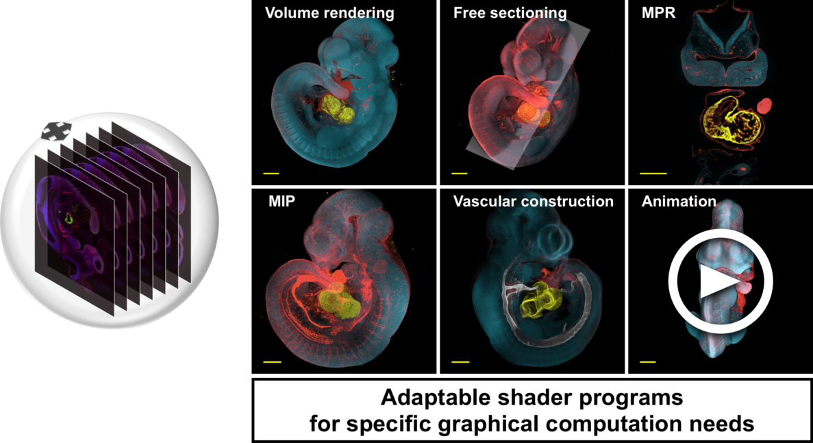
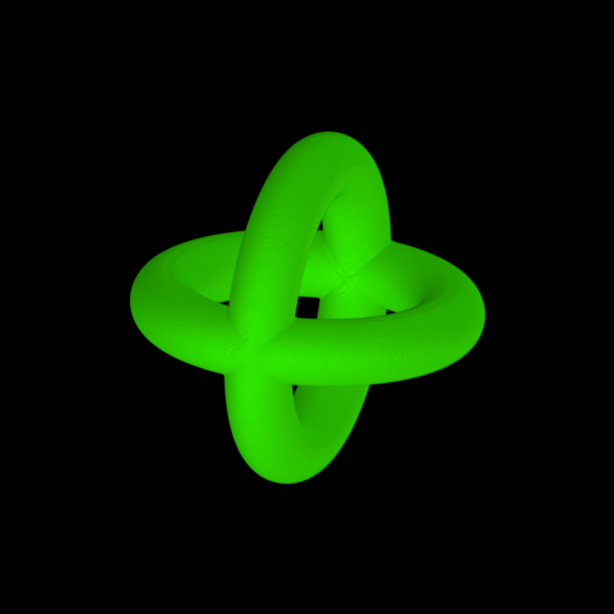
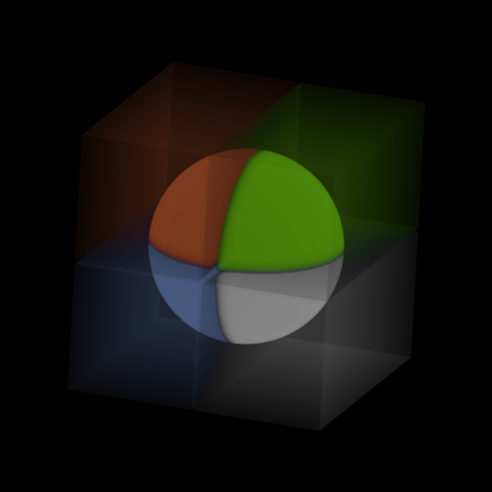
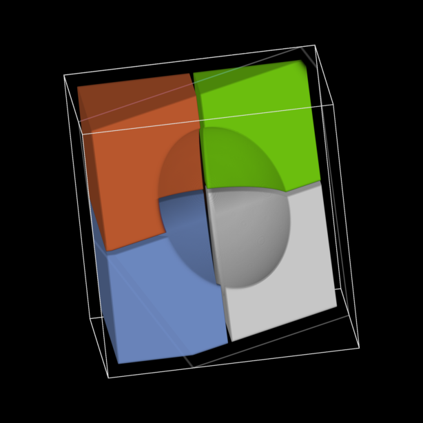
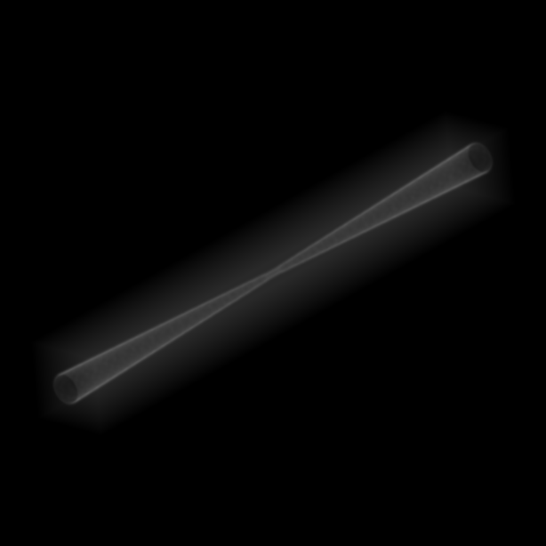

# *Acto3D* - 3D viewer for multichannel fluorocence images
This repository contains the complete source code and compiled binaries of the paper:
- Naoki Takeshita, Kenta Yashiro, et al.  
[***Acto3D: an open-source user-friendly volume rendering software for high-resolution 3D fluorescence imaging in biology***](https://doi.org/10.1242/dev.202550)  
DOI: [10.1242/dev.202550](https://doi.org/10.1242/dev.202550)

Please [cite the paper](#how-to-cite) if you are using this software or code in your research.  

## Overview
Acto3D is a software that enables researchers to easily display and observe multi-channel images taken with a fluorescent microscope in 3D with very simple operations. You can adjust the color tone and opacity in detail for each channel, enabling advanced 3D displays. It is also possible to create sections from any angle and set animations. *Furthermore, for expert users, it is possible to apply any transfer function by changing the transfer function in the [template shader files](https://github.com/Acto3D/Acto3D/tree/main/Acto3D/Shader/Templates) or [sample shader files](https://github.com/Acto3D/Acto3D/tree/main/Acto3D/Shader/SampleShaders)*.
<center>

</center>

***Limitations***  
According to the original paper, Acto3D is designed to expand entire images into a contiguous memory region that can be accessed from the GPU.
- A memory capacity sufficient to unfold all image data in memory is required.
   - The maximum memory capacity that the GPU can allocate at once is displayed as "Max Buffer Size" at the startup of Acto3D.
   - Apple does not publicly disclose the Max Buffer Size for each Mac, but it is generally estimated to be about half of the total system memory capacity.
   - If memory capacity is insufficient, it is possible to reduce the XY size as an option when you load multipage TIFF, but this might not guarantee stable operation.
- Acto3D is currently an application for Mac, and we recommend using a Mac equipped with Apple silicon.
- The dimensions in X, Y, Z must be less than or equal to 2048 pixels.
- The maximum number of fluorescent channels is limited to 4.

### Download
Please refer **[this instruction manual](./instruction.pdf)** for instructions.   

Please download the binary file from [here](https://github.com/Acto3D/Acto3D/releases).<br>
For the sample data, please refer [here](#sample-data).

## Instruction
Acto3D recommends the use of multi-page TIFF files created by Fiji. While it's possible to create 3D from sequential image files with common image formats, following the procedure below ensures that the XYZ resolution is set correctly. Therefore, create multi-page TIFF files from original format in accordance with the following steps.
### Compatible formats
|                                     | 16 bits / channel        | 8 bits / channel                                                           |
| ----------------------------------- | ----------------------- | ------------------------------------------------------------------------- |
| **- Recommend -**<br>Multipage TIFF<br>converted by Fiji<br>(Meta data available) | 1 - 4 channels          | 1 - 4 channels                                                            |
| TIFF stacks                         | 16 bits Grayscale images | 32 bits RGBA images (*)<br>24 bits RGB images<br>8 bits Gray scale images |
| PNG stacks                          |                         | 32 bits RGBA images (*)<br>24 bits RGB images<br>8 bits Gray scale images |
| JPG stacks                          |                         | 32 bits RGBA images (*)<br>24 bits RGB images<br>8 bits Gray scale images |
|Binary Data | Via TCP| Via TCP  |

For binary data transfer, please follow [Acto3D_py instruction](https://github.com/Acto3D/Acto3D_py).

(*): Normally, the "A" in a 32-bit image refers to the opacity channel, but in Acto3D, the "A" can be used as the data for the fourth channel by storing the data of each fluorescent channel in R, G, B, and A.

### Creation of multipage TIFF by Fiji
The following method has been confirmed to work with Fiji (version 2.3.0 / 1.53s):
1. Load into Fiji: Drag and drop the microscope image file into Fiji.
2. Configure Import Options:  
Color mode: Grayscale  
Virtual stack: On (either is acceptable if sufficient memory is available)  
Split channel: Off
3. Optional: Adjust the image range width.
4. Output to TIFF: Click **File** > **Save As** > **Tiff...**.

### Create 3D image in Acto3D
1. To load images, in Acto3D, click **Open images** > **Open ImageJ / Fiji TIFF** and select the file.
2. Optional: to adjust display ranges, XYZ resolution and limit channels, click **Image options**.
3. To create 3D image, click **View in 3D**.  

Please refer **[this instruction manual](./instruction.pdf)** for further instructions.   

### Sample data
##### [Download the Sample Data 1 (for 3D observation) (1.65 GB)](https://drive.google.com/file/d/1VHiLkK2O1ZrWoWX4ahPwnZfNgDQ242Kz/view?usp=sharing).

This dataset consists of a heart from an E13.5 mouse embryo, imaged using the Zeiss Lightsheet 7.

Imaging Specifications:
- Dimensions: 1920 x 1920 px with 597 z stacks
- Resolution: XY = 1.0635 µm/px, Z = 2.4009 µm/px
- Staining: SYTOX Green, Tomato lection-DyLight 594, TNNI3-Alexa Fluor 633
- Data Post-processing: For the sake of reducing file size:
- The data was scaled in the XY direction by 0.5 using Fiji.
- The display range was adjusted.
- It was then converted to 8 bits.

##### [Download the Sample Data 2 (for vascular 3D reconstruction) (1.5 GB)](https://drive.google.com/file/d/1n1Pr_gaB-zFYdcAeKQs6HlwdtKiSKxu1/view?usp=sharing).

This dataset consists of a embryo pharyngeal arch region from an E10.5 mouse embryo, imaged using the Zeiss Lightsheet 7.

Imaging Specifications:
- Dimensions: 1920 x 1920 px with 997 z stacks
- Resolution: XY = 1.0874 µm/px, Z = 1.9251 µm/px
- Staining: SYTOX Green, Tomato lection-DyLight 594
- Data Post-processing: For the sake of reducing file size:
    - The data was scaled in the XY direction by 0.5 using Fiji.
    - The display range was adjusted.
    - It was then converted to 8 bits.

#### Demo Model
Some demo models are available in [File] > [Demo Model]
###### Demo model 1: Tori model


###### Demo model 2: Sphere in cube model



###### Demo model 3: Thin lumen model


### Create a custom shader
In Acto3D, we designed it to allow the use of custom shaders in addition to the built-in shaders, for users who want even finer rendering through a more flexible transfer function.

Users need to write in [Metal Shading Language (MSL)](https://developer.apple.com/documentation/metal/), which is similar to C++.
Please refer to [the instructions](./instruction.pdf) for details.
Initially, specify the `Label`, `Author`, and `Description` so that Acto3D can recognize them. Also, note that the kernel function name must be unique and different from all other shaders.

```Metal
// Label: <Shader Name Here>
// Author: <Author Name Here>
// Description: <Description Here>

kernel void <Function Name Here>(device RenderingArguments &args [[buffer(0)]],
                                 uint2 position [[thread_position_in_grid]]){

}
```

### Compiling from the Source Code
To compile from the source code, you'll need Xcode. Xcode is Apple's integrated development environment (IDE). It's available for free on the [Mac App Store](https://apps.apple.com/app/xcode/id497799835).

The software was originally developed using macOS 12.5.1 and Xcode Version 14.2. Before compiling, you need to disable code signing.

1. Open the project in Xcode.
2. From the navigation panel, select `Acto3D` to access the project settings.
3. Navigate to `Signing & Capabilities` and turn off `Automatically manage signing`.
4. Change the `Signing Certificate` to `Sign to Run Locally`.

Please note that the instructions might vary based on your Xcode version.


## How to cite
[BibTeX](https://journals.biologists.com/Citation/Download?resourceId=346998&resourceType=3&citationFormat=2),
[RIS](https://journals.biologists.com/Citation/Download?resourceId=346998&resourceType=3&citationFormat=0),
[EndNote](https://journals.biologists.com/Citation/Download?resourceId=346998&resourceType=3&citationFormat=1)

```BibTeX
@article{10.1242/dev.202550,
    author = {Naoki Takeshita and Shinichiro Sakaki and Rie Saba and Satoshi Inoue and Kosuke Nishikawa and Atsuko Ueyama and Kazuhiko Matsuo and Masaki Shigeta and Yoshiro Nakajima and Daisuke Kobayashi and Hideya Yamazaki and Kei Yamada and Tomoko Iehara and Kenta Yashiro},
    title = "{Acto3D: an open-source user-friendly volume rendering software for high-resolution 3D fluorescence imaging in biology}",
    journal = {Development},
    volume = {151},
    number = {8},
    pages = {dev202550},
    year = {2024},
    month = {04},
    abstract = "{Advances in fluorescence microscopy and tissue-clearing have revolutionised 3D imaging of fluorescently labelled tissues, organs and embryos. However, the complexity and high cost of existing software and computing solutions limit their widespread adoption, especially by researchers with limited resources. Here, we present Acto3D, an open-source software, designed to streamline the generation and analysis of high-resolution 3D images of targets labelled with multiple fluorescent probes. Acto3D provides an intuitive interface for easy 3D data import and visualisation. Although Acto3D offers straightforward 3D viewing, it performs all computations explicitly, giving users detailed control over the displayed images. Leveraging an integrated graphics processing unit, Acto3D deploys all pixel data to system memory, reducing visualisation latency. This approach facilitates accurate image reconstruction and efficient data processing in 3D, eliminating the need for expensive high-performance computers and dedicated graphics processing units. We have also introduced a method for efficiently extracting lumen structures in 3D. We have validated Acto3D by imaging mouse embryonic structures and by performing 3D reconstruction of pharyngeal arch arteries while preserving fluorescence information. Acto3D is a cost-effective and efficient platform for biological research.}",
    issn = {0950-1991},
    doi = {10.1242/dev.202550},
    url = {https://doi.org/10.1242/dev.202550},
    eprint = {https://journals.biologists.com/dev/article-pdf/151/8/dev202550/3421182/dev202550.pdf},
}
```
